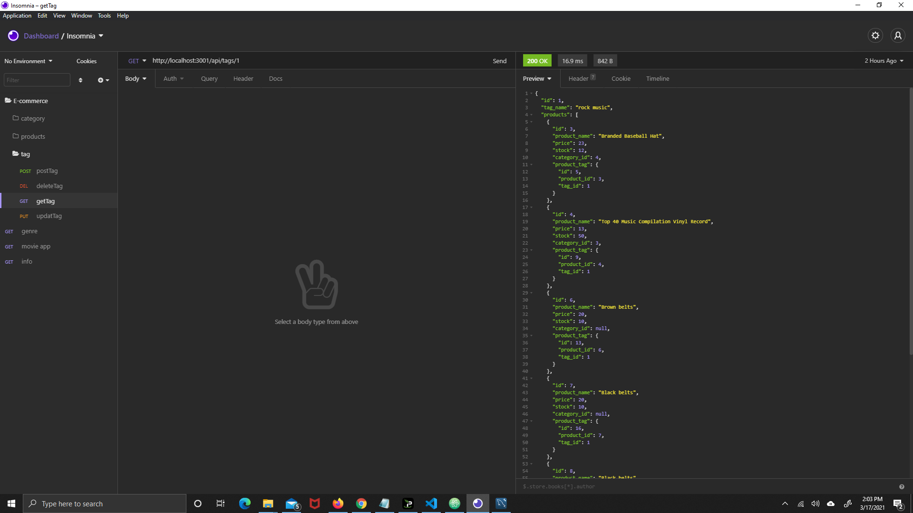

# E-commerce Back-end 

  ## Description
  A  back-end for an e-commerce site. Using an Express.js API and configuring it to use Sequelize to interact with a MySQL database.
    
  ## Table of Contents (Optional)
  If your README is very long, add a table of contents to make it easy for users to find what they need.
  * [Description](#description)
  * [Installation](#installation)
  * [Usage](#usage)
  * [Features](#features)
  * [Tests](#tests)
  * [Questions](#questions)
 

  ## Installation
  You have to clone the repository on to your local machine. Once repo has been cloned, open terminal and run `npm run server`.
    
  ## Usage
  

  For a video walk-through, please click on the link [https://youtu.be/6JQF7C3CFa8](https://youtu.be/6JQF7C3CFa8)

  ## Features
  E-commerce Back-end 
    
  ## Tests
  open terminal and run `npm run server`

  ## Questions
  If you have any questions or comment about this repository, you can reach me at [e.kankam95@hotmail.com](mailto:e.kankam95@hotmail.com).
  Feel free to view more of my work on GitHub at [kwabena95](https://github.com/kwabena95)
